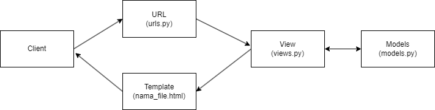

# ReadMe.MD 
## Tugas2
## Savero Arkabuana
## 2106635985

### [Link Web Tugas2](https://veroarkabuana.herokuapp.com/katalog/)

Pemrograman Berbasis Platform (CSGE602022) - diselenggarakan oleh Fakultas Ilmu Komputer Universitas Indonesia, Semester Ganjil 2022/2023



## Penjelasan _flow_ Tugas2

Grafik diatas menunjukan _flow_ dari Tugas2 ini. Pertama-tama sebuah _request_ masuk ke server Django lalu dirutekan melalui ```urls.py``` ke ```views.py```. Lalu ```views.py``` akan mengirim _query_ ke ```models.py```, dan akan memberikan hasil _query_ ke ```views.py```. Setelah _request_ ditangani, hasil akan diterjemahkan ke dalam HTML yang telah dibuat dan HTML akan dikirim kembali ke pengguna sebagai _response_.

## Penjelasan Kode

## urls.py

```urls.py``` pada ```project_django```

```
urlpatterns = [
    path('admin/', admin.site.urls),
    path('', include('example_app.urls')),
    path("katalog/", include("katalog.urls")),
]
```


```urls.py``` pada ```katalog```
```app_name = "katalog"

urlpatterns = [
    path("", show_katalog, name = "show_katalog"),
]
```


## views.py

```
from katalog.models import CatalogItem

def show_katalog(request):
    data_barang_catalog = CatalogItem.objects.all()
    context = {
        "list_barang" : data_barang_catalog,
        "nama" : "Savero Arkabuana",
        "id" : "2106635985",
    }
    return render(request, "katalog.html", context)
```

## models.py

```
class CatalogItem(models.Model):
    item_name = models.CharField(max_length=255)
    item_price = models.BigIntegerField()
    item_stock = models.IntegerField()
    description = models.TextField()
    rating = models.IntegerField()
    item_url = models.URLField()
```

## html

```

    <tr>
        <th>{{item.item_name}}</th>
        <th>{{item.item_price}}</th>
        <th>{{item.item_stock}}</th>
        <th>{{item.rating}}</th>
        <th>{{item.description}}</th>
        <th>{{item.item_url}}</th>
      </tr>
    
```

## Contoh Deployment 

Pada template ini, deployment dilakukan dengan memanfaatkan GitHub Actions sebagai _runner_ dan Heroku sebagai platform Hosting aplikasi. 

Untuk melakukan deployment, kamu dapat melihat instruksi yang ada pada [Tutorial 0](https://pbp-fasilkom-ui.github.io/ganjil-2023/assignments/tutorial/tutorial-0).

Untuk contoh aplikasi Django yang sudah di deploy, dapat kamu akses di [https://django-pbp-template.herokuapp.com/](https://django-pbp-template.herokuapp.com/)

## Credits

Template ini dibuat berdasarkan [PBP Ganjil 2021](https://gitlab.com/PBP-2021/pbp-lab) yang ditulis oleh Tim Pengajar Pemrograman Berbasis Platform 2021 ([@prakashdivyy](https://gitlab.com/prakashdivyy)) dan [django-template-heroku](https://github.com/laymonage/django-template-heroku) yang ditulis oleh [@laymonage, et al.](https://github.com/laymonage). Template ini dirancang sedemikian rupa sehingga mahasiswa dapat menjadikan template ini sebagai awalan serta acuan dalam mengerjakan tugas maupun dalam berkarya.
