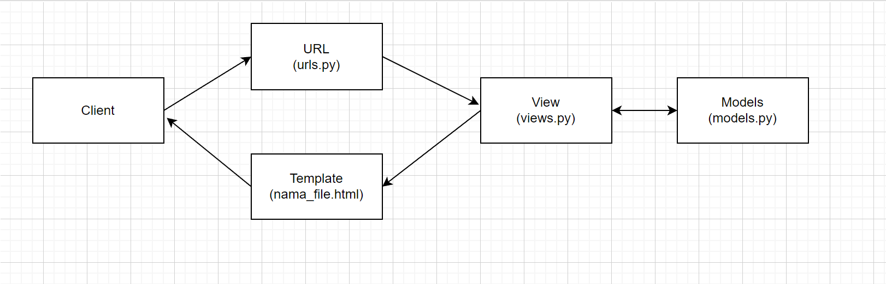

# ReadMe.MD 
## Tugas2
## Savero Arkabuana
## 2106635985

### [Link Aplikasi Tugas2](https://veroarkabuana.herokuapp.com/katalog/)

Pemrograman Berbasis Platform (CSGE602022) - diselenggarakan oleh Fakultas Ilmu Komputer Universitas Indonesia, Semester Ganjil 2022/2023



## Penjelasan _flow_ Tugas2

Grafik diatas menunjukan _flow_ dari Tugas2 ini. Pertama-tama sebuah _request_ masuk ke server Django lalu dirutekan melalui ```urls.py``` ke ```views.py```. Lalu ```views.py``` akan mengambil data dari ```models.py```, dan akan memberikan hasil dalam bentuk _query_ kembali ke ```views.py```. Setelah _request_ ditangani, hasil akan diterjemahkan ke dalam html yang telah dibuat dan html akan dikirim kembali ke pengguna sebagai _response_.

## Penjelasan Cara Mengimplementasikan Poin 1 Sampai dengan 4.

Melakukan _set-up_ pembuatan aplikasi dengan menggunakan Virtual Enviroment dan melakukan _clone_ dari _template_, lalu mulai mengisi arahan _template_.

### urls.py

```urls.py``` pada ```project_django```

```
urlpatterns = [
    path('admin/', admin.site.urls),
    path('', include('example_app.urls')),
    path("katalog/", include("katalog.urls")),
]
```
Pada bagian ```urls.py``` di ```project_django```, ditambahkan line ```path("katalog/", include("katalog.urls"))``` yang berfungsi sebagai arahan untuk mengambil data sesuai dengan _request_.

```urls.py``` pada ```katalog```

```app_name = "katalog"

urlpatterns = [
    path("", show_katalog, name = "show_katalog"),
]
```
Pada bagian ```urls.py``` di ```katalog```, ditambahkan line ```app_name = "katalog"``` yang berfungsi untuk menambahkan _namespace_ untuk aplikasi dan line ```path("", show_katalog, name = "show_katalog")``` berfungsi sebagai arahan untuk menampilkan isi data dari _function_ ```show_katalog``` pada ```views.py``` .

### models.py

```
class CatalogItem(models.Model):
    item_name = models.CharField(max_length=255)
    item_price = models.BigIntegerField()
    item_stock = models.IntegerField()
    description = models.TextField()
    rating = models.IntegerField()
    item_url = models.URLField()
```

Pada bagian ```models.py```, ada proses pendefinisian _database_ yang akan disimpan pada variabel-variabel untuk dipakai pada ```views.py```.

### views.py

```
from katalog.models import CatalogItem

def show_katalog(request):
    data_barang_catalog = CatalogItem.objects.all()
    context = {
        "list_barang" : data_barang_catalog,
        "nama" : "Savero Arkabuana",
        "id" : "2106635985",
    }
    return render(request, "katalog.html", context)
```
Pada bagian ```views.py``` di ```katalog``` berisi _function_ ```show_katalog``` yang memuat _database_ pada ```models.py``` untuk disimpan pada variabel ```list_barang``` agar variabel bisa digunakan dalam _loop_ pada html agar bisa ditampilkan.


### html

```

    <tr>
        <th>{{item.item_name}}</th>
        <th>{{item.item_price}}</th>
        <th>{{item.item_stock}}</th>
        <th>{{item.rating}}</th>
        <th>{{item.description}}</th>
        <th>{{item.item_url}}</th>
      </tr>
    
```
Pada bagian html, terdapat penambahan _loop_ yang berfungsi untuk memanggil variabel yang telah di-_define_ pada ```views.py``` dan parameter data yang diambil adalah pada variabel ```list_barang``` yang telah di-_define_ untuk mencakup semua isi _object_ pada ```models.py```. Data-data yang sesuai kemudian akan ditampilkan dalam aplikasi.

### Deployment

Setelah selesai mengisi _template_, _repository_ kemudian disimpan pada akun GitHub dengan menggunakan ```git add .```, ```git commit -m "commit message"```, dan ```git push```. Setelah _repository_ telah disimpan, akan di-_deploy_ menggunakan _platform_ Heroku dengan mengikuti arahan pada _template_ yang diberikan pada Tugas2 ini.

## Pengembangan Aplikasi dengan Virtual Environment
Dalam pengembangan sebuah aplikasi dengan python, pengembangan menggunakan Virtual Environment direkomendasikan agar mengisolasi proses pengembangan aplikasi tersebut Hal ini dikarenakan Virtual Environment berfungsi untuk menjaga dependensi proyek tetap terpisah dan tidak menyebabkan konflik _web based_ apabila proses pengembangan aplikasi dilakukan pada _web based_ yang berbeda. Pengembangan apilkasi tanpa Virtual Enviroment tetap bisa dilakukan, tapi tidak dianjurkan agar menghindari proses konflik _web based_ yang berbeda dan meng-_install_ _requirements_ berbeda untuk masing-masing _web based_.


Pada template ini, deployment dilakukan dengan memanfaatkan GitHub Actions sebagai _runner_ dan Heroku sebagai platform Hosting aplikasi. 

Untuk melakukan deployment, kamu dapat melihat instruksi yang ada pada [Tutorial 0](https://pbp-fasilkom-ui.github.io/ganjil-2023/assignments/tutorial/tutorial-0).

Untuk contoh aplikasi Django yang sudah di deploy, dapat kamu akses di [https://django-pbp-template.herokuapp.com/](https://django-pbp-template.herokuapp.com/)

## Credits

Template ini dibuat berdasarkan [PBP Ganjil 2021](https://gitlab.com/PBP-2021/pbp-lab) yang ditulis oleh Tim Pengajar Pemrograman Berbasis Platform 2021 ([@prakashdivyy](https://gitlab.com/prakashdivyy)) dan [django-template-heroku](https://github.com/laymonage/django-template-heroku) yang ditulis oleh [@laymonage, et al.](https://github.com/laymonage). Template ini dirancang sedemikian rupa sehingga mahasiswa dapat menjadikan template ini sebagai awalan serta acuan dalam mengerjakan tugas maupun dalam berkarya.
