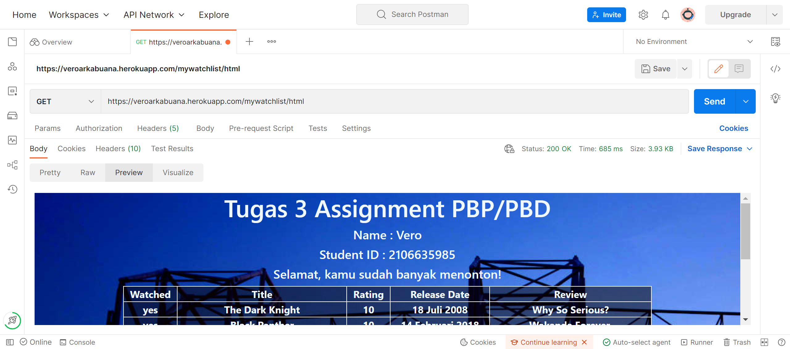
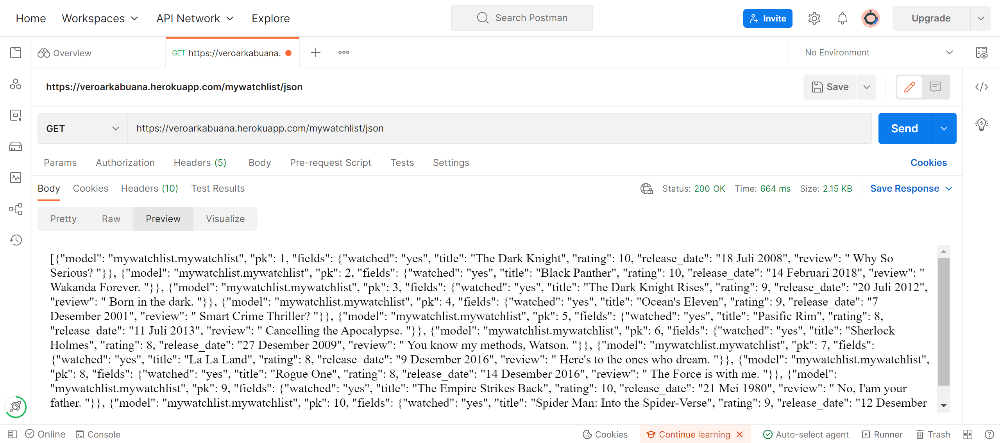
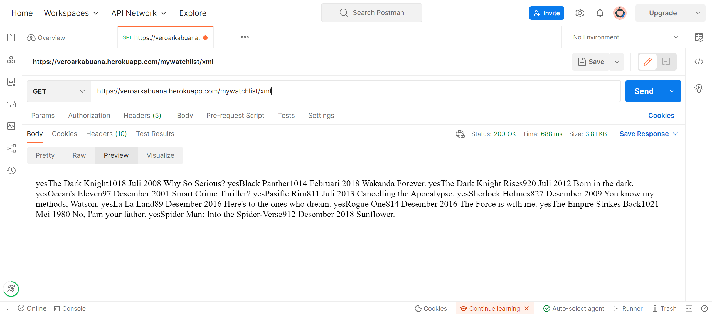

# ReadMe.MD 
## Tugas3
## Savero Arkabuana
## 2106635985

### [Link Aplikasi Tugas3](https://veroarkabuana.herokuapp.com/mywatchlist/)
### [html](https://veroarkabuana.herokuapp.com/mywatchlist/html/)
### [JSON](https://veroarkabuana.herokuapp.com/mywatchlist/json/)
### [XML](https://veroarkabuana.herokuapp.com/mywatchlist/xml/)

Pemrograman Berbasis Platform (CSGE602022) - diselenggarakan oleh Fakultas Ilmu Komputer Universitas Indonesia, Semester Ganjil 2022/2023

## Jelaskan perbedaan antara JSON, XML, dan HTML!.

### JSON
- JSON (JavaScript Object Notation) adalah format yang bermanfaat untuk menyimpan, membaca, dan mentransfer data dari server web. JSON berfungsi untuk merepresentasi data dalam bentuk _key-value pairs_ yang memudahkan data untuk di-_convert_ dari objek pada JavaScript.

### XML
- XML (eXtensible Markup Language) merupakan _markup language_ yang mirip dengan HTML, tetapi tanpa _tags_ yang sudah ditentukan. XML berguna untuk menyimpan dan memindahkan data _tag_ yang bisa disimpan dalam format yang bisa disesuaikan

### HTML
- HTML (HyperText Markup Language) merupakan _markup language_ yang berorientasi pada penyajian data pada sebuah web agar bisa ditampilkan sesuai dengan kemauan _developer_. HTML berbeda dengan XML dikarenakan adanya _tags_ yang sudah di _defined_ oleh HTML.

## Jelaskan mengapa kita memerlukan data delivery dalam pengimplementasian sebuah platform?

Apabila dalam pengembangan suatu web, maka akan ada _request_ data yang bisa meminta berbagai macam _format_. Untuk memastikan data dapat disajikan dalam keseluruhan _platform_, maka perlu dipastikannya adanya _data delivery_ dan pembuatan JSON, HTML, dan XML, agar data bisa di-_handle_ apabila ada _request_ yang membutuhkan _format_ yang berbeda.


## Jelaskan bagaimana cara kamu mengimplementasikan checklist di atas.


### Membuat aplikasi baru

- Menyalakan _virtual enviroment_ pada _cmd_ direktori yang sesuai dan membuat _app baru_ dengan _command_ ```python manage.py startapp mywishlist``` di _cmd_ serta menambahkan ```"mywatchlist"``` pada ```settings.py``` untuk membuat _template_ aplikasi baru.


### Membuat path baru untuk mywatchlist

- Menambahkan ```path("mywatchlist/", include("mywatchlist.urls")),``` pada ```urls.py``` _project_django_.


### Menambahkan models yang dibutuhkan untuk mywatchlist

- Memasukkan _models_ yang dibutuhkan mywatchlist pada variabel-variabel yang akan dipakai dalam _file_ pada mywatchlist.

```
from django.db import models

# Create your models here.
class MyWatchList(models.Model):
    watched = models.CharField(max_length=50)
    title = models.CharField(max_length=255)
    rating = models.IntegerField()
    release_date = models.CharField(max_length=255)
    review = models.TextField()
```


### Melakukan Migrations di CMD

- Menjalankan _command _ ```python manage.py makemigrations``` lalu ```python manage.py migrate``` pada _cmd_ untuk melakukan migrasi skema model ke dalam _database_ Django lokal.


### Membuat initial_watchlist_data.json pada mywacthlist dan _load_ kepada _database_ Django lokal.

- Membuat folder _fixtures_ dan file ```initial_watchlist_data.json``` agar bisa menambahkan _object_ dan _fields_ yang diinginkan dan format data dijadikan .json agar bisa diakses _key valuenya_ pada ```views.py```.

```
[
    {
        "model": "mywatchlist.mywatchlist",
        "pk": 1,
        "fields": {
            "watched": "yes",
            "title": "The Dark Knight",
            "rating": 10,
            "release_date": "18 Juli 2008",
            "review": " Why So Serious? "
        }
    }, ##dan seterusnya
]
```

Lalu setelah selesai mengisi initial_watchlist_data.json, melakukan _command_ ```python manage.py loaddata initial_watchlist_data.json```.


### Menambahkan urlpatterns pada urls.py mywatchlist

- Berbeda dengan urlpatterns pada katalog, perlu ditambahkan potongan kode dibawah ini,

```
path('html/', show_mywatchlist, name='show_mywatchlist'),
path('xml/', show_xml, name="show_xml"),
path('json/', show_json, name="show_json"),
path('json/<int:id>', show_json_by_id, name="show_json_by_id"),
```

agar routing bisa menampilkan data dengan format file yang sesuai.


### Mengisi views.py

- Mengimport _models_ yang sudah dibuat pada ```models.py``` dan mengakses _dictionary_ yang ada pada ```initial_watchlist_data.json```. Lalu menambahkan serta mengisi variabel yang ingin ditampilkan pada html dan membuat _looping_ yang akan menghitung jumlah film yang ditonton dengan _keyword_ ```"yes"```.

#### Algoritma _looping_

```
def show_mywatchlist(request):
    data_film_wishlist = MyWatchList.objects.all()
    context = {
    "list_film": data_film_wishlist,
    "nama" : "Vero",
    "npm" : "2106635985",
    "watched": 0,
    "selamat": ""
    }
    for i in context.get("list_film"):
        if i.watched == "yes":
            context["watched"] += 1
    if (len(context.get("list_film")) / 2) <= context["watched"]:
        context["selamat"] += "Selamat, kamu sudah banyak menonton!"
    else:
        context["selamat"] += "Wah, kamu masih sedikit menonton!"
```

_looping_ dibuat dengan mengambil isi dari _dictionary_ ```initial_watchlist_data.json``` yang disimpan pada variabel ```list_film``` dan menghitung fields ```watched``` yang mengandung "yes" agar dihitung berapa banyak film yang sudah ditonton. Apabila sudah dihitung dan ditambahkan kepada variabel ```watched``` yang sudah dibuat pada ```show_mywatchlist```, _looping_ akan membandingkan jumlah film dengan variabel ```watched``` dan menambahkan _string_ yang sesuai kepada variabel "selamat".

Pada ```views.py``` juga ditambahkan fungsi-fungsi yang akan menyajikan data dalam format bentuk XML dan JSON.


### Mengisi file html

- Sama seperti katalog.html, pengisian html disesuaikan dengan variabel pada ```views.py``` serta pembuatan tabel yang di-_format_ agar selalu ditengah layar. _looping_ juga diisi dengan variabel pada ```models.py```.


### Pembuatan file testing

- Pada ```tests.py``` di mywatchlist, dibuat _class_ yang diberi nama awal _Testlist_ dan diisi dengan _function_ yang akan melakukan testing untuk setiap format file.

```
def test_mywatchlisthtml_exists(self):
    response = Client().get('/mywatchlist/html/')
    self.assertEqual(response.status_code,200)

def test_mywatchlistjson_exists(self):
    response = Client().get('/mywatchlist/json/')
    self.assertEqual(response.status_code,200)

def test_mywatchlistxml_exists(self):
    response = Client().get('/mywatchlist/xml/')
    self.assertEqual(response.status_code,200)
```


### Deployment

- Setelah selesai mengisi file-file pada mywatchlist, _repository_ kemudian disimpan pada akun GitHub dengan menggunakan ```git add .```, ```git commit -m "commit message"```, dan ```git push```. Setelah _repository_ telah disimpan, akan di-_deploy_ menggunakan _platform_ Heroku dengan mengikuti arahan pada _template_ yang digunakan pada Tugas2 sebelum Tugas3 ini.

## Screenshot Postman html, JSON, dan XML





## Sumber

https://github.com/pbp-fasilkom-ui/assignment-repository
https://docs.djangoproject.com/en/4.1/topics/http/urls/#:~:text=Django%20runs%20through%20each%20URL,a%20class%2Dbased%20view).
https://www.geeksforgeeks.org/python-virtual-environment/
https://docs.djangoproject.com/en/4.1/topics/db/models/
https://docs.djangoproject.com/en/4.1/topics/http/views/
https://stackoverflow.com/questions/48282473/how-to-make-a-loop-in-html
https://www.coursera.org/lecture/service-oriented-architecture/4-1-5-html-xml-json-rK9X5


